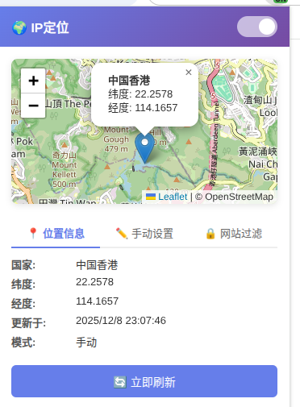

# IP定位 - Chrome 浏览器扩展 | [English](#english)

> 🔄 **二次开发项目** - 基于 F-Droid 大佬的原项目进行二次开发，感谢原作者的贡献！
>
> 本项目根据代理自动更新IP位置，增强了某些网站的伪装能力。

基于IP位置自动更新浏览器的GPS位置。

## 截图预览

| 主界面 | 手动设置 |
|:---:|:---:|
|  |  |

## 功能特性

- 🌍 **自动定位**: 根据IP地址自动获取地理位置
- 📍 **手动设置**: 支持手动输入经纬度或在地图上点击选择位置
- 🔒 **网站过滤**: 支持白名单和黑名单，灵活控制哪些网站使用伪装位置
- 🗺️ **地图预览**: 内置地图显示当前位置
- 🔄 **自动更新**: 定时自动更新位置信息

## 安装方法

1. 下载本项目所有文件
2. 打开 Chrome 浏览器，进入 `chrome://extensions/`
3. 开启右上角的"开发者模式"
4. 点击"加载已解压的扩展程序"
5. 选择本项目文件夹

## 使用说明

### 自动模式
扩展会自动根据您的IP地址获取地理位置，并将其应用到浏览器的地理位置API。

### 手动模式
1. 点击扩展图标打开弹窗
2. 切换到"手动设置"标签页
3. 选择"手动设置"模式
4. 输入经纬度坐标或在地图上点击选择位置
5. 点击"应用此位置"

### 网站过滤
- **白名单**: 添加的网站将不会使用伪装位置
- **黑名单**: 只有添加的网站才会使用伪装位置（优先级高于白名单）

## 隐私说明

当检测到IP位于中国大陆时，为保护隐私，将使用默认位置（北京）代替真实位置。

## 作者

- GitHub: [https://github.com/1776686596](https://github.com/1776686596)
- 邮箱: [IPGeolocation@daisheng.xyz](mailto:IPGeolocation@daisheng.xyz)

## 许可证

MIT License

---

# IP Geolocation - Chrome Extension | [中文](#ip定位---chrome-浏览器扩展--english)

> 🔄 **Secondary Development Project** - Based on F-Droid's original project. Thanks to the original author!
>
> This project automatically updates IP location based on proxy, enhancing disguise capabilities for certain websites.

Automatically update browser GPS location based on IP location.

## Screenshots

| Main Interface | Manual Settings |
|:---:|:---:|
|  |  |

## Features

- 🌍 **Auto Location**: Automatically get geolocation based on IP address
- 📍 **Manual Settings**: Support manual input of coordinates or click on map to select location
- 🔒 **Website Filter**: Support whitelist and blacklist for flexible control
- 🗺️ **Map Preview**: Built-in map to display current location
- 🔄 **Auto Update**: Automatically update location periodically

## Installation

1. Download all files from this project
2. Open Chrome browser, go to `chrome://extensions/`
3. Enable "Developer mode" in the top right corner
4. Click "Load unpacked"
5. Select this project folder

## Usage

### Auto Mode
The extension will automatically get geolocation based on your IP address and apply it to the browser's geolocation API.

### Manual Mode
1. Click the extension icon to open popup
2. Switch to "Manual Settings" tab
3. Select "Manual Settings" mode
4. Enter coordinates or click on map to select location
5. Click "Apply this location"

### Website Filter
- **Whitelist**: Added websites will NOT use the spoofed location
- **Blacklist**: Only added websites will use the spoofed location (higher priority than whitelist)

## Privacy Notice

When IP is detected in mainland China, a default location (Beijing) will be used instead of the real location for privacy protection.

## Author

- GitHub: [https://github.com/1776686596](https://github.com/1776686596)
- Email: [IPGeolocation@daisheng.xyz](mailto:IPGeolocation@daisheng.xyz)

## License

MIT License